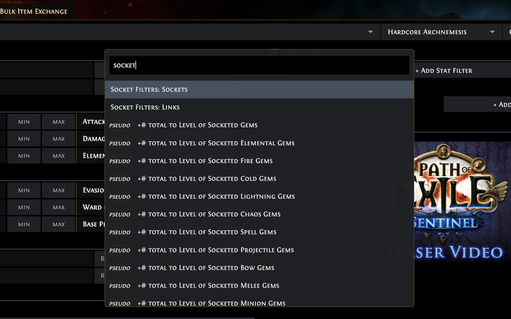

# Path of Exile Trade Hotkey Omnisearch
A Chrome extension adding hotkeys and a single "omni" searchbox to the Path
of Exile [trade
site](https://www.pathofexile.com/trade/search/). Search for trades 
**using only your keyboard to navigate.**

## Features
Press `;` to bring up the omnisearch box. Start typing to find **any filter in any
language**, including the filters on the left hand side of the trade UI
(corrupted, split, DPS, item category, etc.).



It also adds a variety of hotkeys to navigate the UI, so that you never have to
resort to using the mouse.

For example: 
* `;` + `frac strength` brings up fractured strength, fractured strength and dex, etc.
* `;` + `links` jumps to the socket links filter, after which you can press
    `tab` to navigate.

Press `?` after installing to learn more.

## Installation
Install in the [Chrome Web Store](https://chrome.google.com/webstore/detail/path-of-exile-trade-hotke/emekiohhckejeabmakkjjdglllaolmad?hl=en&authuser=0).

## Contributing

### Open features
Pull requests are welcome. If you're interested in improving the extension in
some way, feel free to file an issue to open discussion.

Some potential features for open source contributors:
* **Custom hotkeys:** Using the Chrome popup to store a user's hotkey
    configuration, then wiring that through the app.
* **Omnibox result shortcuts:** Adding shortcut keys for omnibox selection (ctrl+1, ctrl+2, ...) to quickly
    select visible options.
* **Bulk currency exchange:** A shortcut to navigate to the page; shortcuts on
    that page.
* **Stat groups:** Using AND, OR, etc on stat filters
* **League selector:** Hotkey to focus league selector ("Hardcore", "Standard", etc.)

### Structure
This README assumes some basic knowledge of the terminology around Chrome
extensions.

It uses a React app in the content script (built using
[react-content-script](https://github.com/yosevu/react-content-script)). If you
would like to better understand the structure of the app, then looking at the
bare boilerplate for that repository would be helpful.

There is no popup or background at the time of writing.

### Installing and developing locally

```
yarn install
yarn build
```

This creates a `build/` directory. Go to `chrome://extensions` and click "Load
Unpacked Extension". Select the `build/` directory, and it should get added
([instructions on
StackExchange](https://superuser.com/questions/247651/how-does-one-install-an-extension-for-chrome-browser-from-the-local-file-system)).

### References
This repository is built off combining two boilerplates. Looking at these
minimal examples may be useful if you are confused about the flow.
* [chrome-extension-typescript-starter](https://github.com/chibat/chrome-extension-typescript-starter)
* [react-content-script](https://github.com/yosevu/react-content-script)
